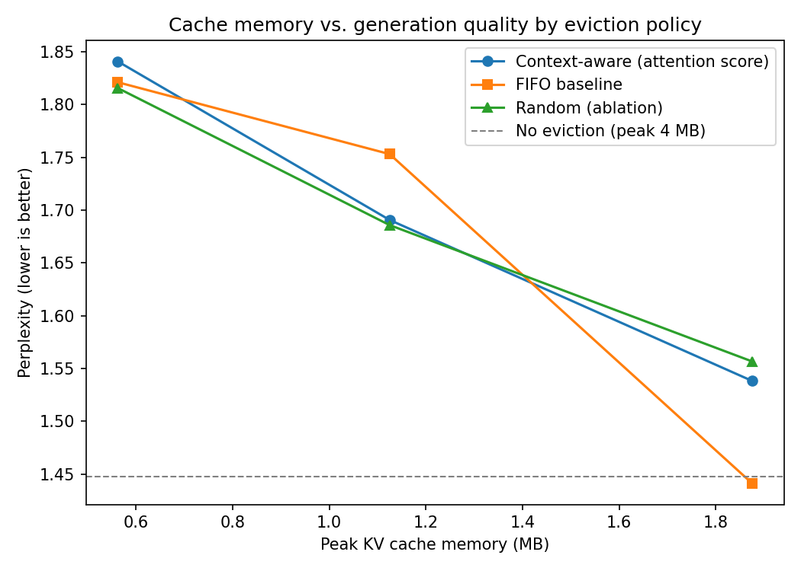

# Context-Aware KV Cache Optimizer

A KV cache eviction system for LLM inference. Instead of letting
the KV cache grow linearly with sequence length (which is the usual memory bottleneck
in autoregressive decoding), this project scores cached tokens by how much
attention they receive and evicts the least important ones once a memory
budget is hit, similar in to the H2O ("heavy hitter oracle") line of
work, implemented here directly against Hugging Face `transformers`' modern
`Cache` API.

## Why this exists

Serving long-context LLMs is memory bound, not compute bound, once the KV
cache dominates GPU memory. This project is a hands-on demonstration of:

- How the KV cache actually works at the tensor level (shapes, per-layer
  storage, how `transformers` manages it internally)
- A concrete memory reduction technique (attention-score-based eviction)
  with measurable tradeoffs against simpler baselines (FIFO / random)
- Correct handling of a subtle correctness issue: RoPE position ids after
  non-contiguous token eviction (see `cache_manager.py` docstring)
- A benchmark harness that produces the tradeoff curve serving teams
  actually care about: memory saved vs. quality lost

## Architecture

```
src/kv_cache_optimizer/
  cache_manager.py   # CacheConfig + KVCacheManager: scoring, eviction, budget logic
  generate.py         # manual decode loop that wires the manager into model.forward()
  eval_harness.py     # runs baseline vs. attention/recency/random policies, computes stats
scripts/
  run_demo.py          # single generation with cache stats printed
  run_benchmark.py     # full policy comparison, writes results/benchmark.csv
  plot.py              # memory-vs-perplexity tradeoff figure
tests/
  test_cache_manager.py  # unit tests for eviction logic (no GPU or model needed)
```

**Why a manual decode loop instead of `model.generate()`:** `generate()` gives
no hook between decode steps to inspect or mutate the cache, and no control
over absolute position ids once tokens are evicted. The loop in `generate.py`
trades convenience for that control.

**Eviction policy:** at each step, a per-token importance score accumulates
attention mass received across layers and heads. When cache length exceeds
the configured budget, the lowest-scoring tokens are dropped, except for a
protected prefix (e.g. a system prompt) and a recency window (very recent
tokens are always kept, since evicting them breaks local coherence even when
their attention score happens to be low). `recency` (pure sliding window) and
`random` policies are included as baselines for the comparison plot.

**Important `transformers` version note:** modern `transformers` (5.x)
dropped the legacy tuple-of-tuples cache format. This project reads and
writes `cache.layers[i].keys` / `.values` directly on the `Cache` object.
It also requires `attn_implementation="eager"` when using the `attention`
scoring policy, because the default SDPA/flash-attention kernels never
materialize attention weights, so `output_attentions=True` would silently
return `None`. The scripts handle this for you; if you write your own
loading code, watch out for this.

## Setup

Tuned for a 6GB GPU (developed against a GTX 1660 Ti, no Tensor Cores,
compute capability 7.5, so FlashAttention-2's official kernels are not
available; eager/SDPA attention is used instead).

```bash
pip install -r requirements.txt
```

Recommended models for a 6GB card: `Qwen/Qwen2.5-0.5B-Instruct`,
`Qwen/Qwen2.5-1.5B-Instruct`, or `meta-llama/Llama-3.2-1B-Instruct`. Keep the
model small on purpose, the point is to make the KV cache the memory
bottleneck at moderate context lengths (4 to 8k tokens), not the weights.

## Usage

```bash
# single run with eviction stats
python scripts/run_demo.py --model Qwen/Qwen2.5-0.5B-Instruct --budget 256 --scoring attention

# compare policies across several budgets, writes results/benchmark.csv
python scripts/run_benchmark.py --model Qwen/Qwen2.5-0.5B-Instruct --budgets 128 256 512

# turn that CSV into the headline figure
python scripts/plot.py

# unit tests (no GPU or model download needed)
python -m pytest tests/ -v
```

## Results





| policy_name               | scoring   | budget | prompt_len | generated_len | peak_cache_mb | tokens_per_sec     | evicted_count | perplexity         |
|---------------------------|-----------|--------|------------|---------------|---------------|--------------------|---------------|--------------------|
| baseline_no_eviction      | attention | 317    | 166        | 150           | 3.703125      | 13.531117619405682 | 0             | 2.8477261066436768 |
| context_aware_budget128   | attention | 128    | 166        | 150           | 1.5           | 12.59460447644969  | 188           | 3.629343271255493  |
| fifo_baseline_budget128   | recency   | 128    | 166        | 150           | 1.5           | 13.970944384880802 | 188           | 4.995035171508789  |
| random_ablation_budget128 | random    | 128    | 166        | 150           | 1.5           | 11.86134655221215  | 188           | 2.841912269592285  |
| context_aware_budget256   | attention | 256    | 166        | 150           | 3.0           | 11.908109784759104 | 60            | 2.8477261066436768 |
| fifo_baseline_budget256   | recency   | 256    | 166        | 150           | 3.0           | 13.521132001328338 | 60            | 2.8477261066436768 |
| random_ablation_budget256 | random    | 256    | 166        | 150           | 3.0           | 15.15630408439566  | 60            | 2.8477261066436768 |
| context_aware_budget512   | attention | 512    | 166        | 150           | 3.703125      | 15.217926953266577 | 0             | 2.8477261066436768 |
| fifo_baseline_budget512   | recency   | 512    | 166        | 150           | 3.703125      | 14.166893580917995 | 0             | 2.8477261066436768 |
| random_ablation_budget512 | random    | 512    | 166        | 150           | 3.703125      | 14.321425647056374 | 0             | 2.8477261066436768 |

### Findings
At the two larger budgets (3.0 MB and 3.7 MB), all three policies sit right on that dashed line. The budget wasn't tight enough to force much eviction yet, so all four setups behave almost identically.

Also, another interesting point is the tightest budget (1.5 MB). There, FIFO is clearly worst (perplexity near 5.0), your context-aware policy is noticeably better (3.6), and random ties with the unconstrained baseline (2.8).

**Issue**: That last result of random eviction matching the no-limit baseline, is a bad result. Randomly deleting most of the context should not produce output as coherent as keeping everything. If anything it should be the worst of the three eviction policies, not the best.


## Notes

This project demonstrates: KV cache memory mechanics, a concrete inference
optimization technique with measured tradeoffs, correct RoPE handling under
cache mutation, and a reproducible benchmark harness, the kind of systems
understanding that's directly relevant to LLM inference optimization roles.
Be ready to discuss the memory vs. quality tradeoff curve and why the
recency window and protected prefix exemptions exist.
